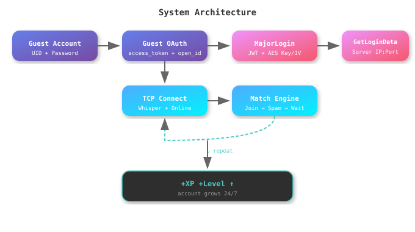
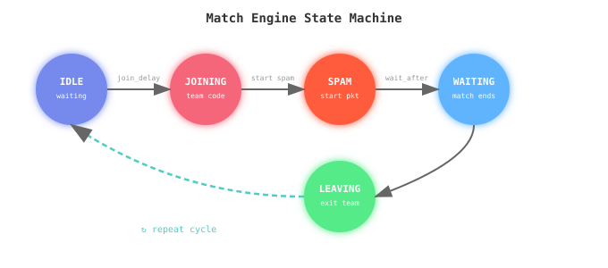
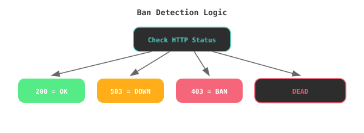

<div align="center">

<!-- Animated Banner SVG -->


<!-- Badges -->


<!-- Animated Status Badge -->


</div>

---

<div align="center">

## 📋 Table of Contents

| # | Section | # | Section |
|---|---------|---|---------|
| 1 | [Overview](#-overview) | 8 | [How It Works](#-how-it-works) |
| 2 | [Features](#-features) | 9 | [Authentication Flow](#-authentication-flow) |
| 3 | [Installation](#-installation) | 10 | [Match Engine](#-match-engine) |
| 4 | [Configuration](#-configuration) | 11 | [Ban Detection](#-ban-detection) |
| 5 | [Usage](#-usage) | 12 | [FAQ](#-faq) |
| 6 | [Menu Preview](#-menu-preview) | 13 | [Troubleshooting](#-troubleshooting) |
| 7 | [Project Structure](#-project-structure) | 14 | [Credits](#-credits) |

</div>

---

## 🔥 Overview

<details open>
<summary><b>What is Free Fire Level Bot?</b></summary>

<br>

The Free Fire Level Bot is an automated tool designed to **level up Free Fire accounts** by repeatedly joining team matches, starting them, waiting for completion, and leaving — 24/7 without manual intervention. It runs directly on **Android via Termux**, making it accessible without a PC.

The bot handles the full Garena authentication pipeline: guest OAuth token grant, MajorLogin encrypted protobuf handshake, GetLoginData server discovery, and TCP socket communication with game servers — all automatically.

</details>

<!-- Architecture Overview SVG -->
<div align="center">



</div>

---

## ✨ Features

<div align="center">

| Feature | Description |
|---------|-------------|
| 🤖 **Full Automation** | Join → Start → Wait → Leave → Repeat. No manual input needed after setup. |
| 📱 **Termux Support** | Runs directly on Android via Termux. No PC required. |
| 🔐 **Complete Auth Flow** | Guest OAuth → MajorLogin → GetLoginData → TCP — all handled automatically. |
| 🔄 **Retry Logic** | Failed connections auto-retry with configurable delays. |
| 🛡️ **Ban Detection** | Distinguishes between server-down (503), actual bans (400/403), and dead accounts. |
| 📊 **Guest Info** | Check account level, likes, clan, region, and ban status. |
| 🎯 **Custom Settings** | Configurable spam duration, packet delay, wait time, and max cycles. |
| 🔍 **Bulk Checker** | Check all guest accounts at once with the standalone Guest Checker tool. |
| 🐳 **Docker Ready** | Dockerfile and docker-compose included for containerized deployment. |
| 🌐 **Proxy Support** | Configurable proxy rotation for different regions. |

</div>

<!-- Feature Icons SVG -->
<div align="center">


</div>

---

## 📦 Installation

<details>
<summary><b>📱 Termux Installation (Recommended for Android)</b></summary>

<br>

### Quick Setup

```bash
# 1. Install Termux from F-Droid (not Play Store)
# 2. Update packages
pkg update && pkg upgrade -y

# 3. Install Python and dependencies
pkg install python git -y
pip install httpx pycryptodome protobuf protobuf-decoder PyJWT

# 4. Clone the repo
git clone https://github.com/ISMAILdz13/FreeFireLevelBot.git
cd ff-level-bot

# 5. Or use the setup script
chmod +x SETUP_LEVEL_TERMUX.sh
./SETUP_LEVEL_TERMUX.sh

# 6. Run the bot
python level_menu.py
```

### One-Liner Install
```bash
pkg update -y && pkg install python git -y && pip install httpx pycryptodome protobuf protobuf-decoder PyJWT && git clone https://github.com/ISMAILdz13/FreeFireLevelBot.git && cd ff-level-bot && python level_menu.py
```

</details>

<details>
<summary><b>🐧 Linux / macOS Installation</b></summary>

<br>

```bash
# 1. Ensure Python 3.8+ is installed
python3 --version

# 2. Clone the repo
git clone https://github.com/ISMAILdz13/FreeFireLevelBot.git
cd ff-level-bot

# 3. Create virtual environment (optional but recommended)
python3 -m venv venv
source venv/bin/activate

# 4. Install dependencies
pip install -r requirements.txt

# 5. Run the bot
python3 level_menu.py
```

</details>

<details>
<summary><b>🐳 Docker Installation</b></summary>

<br>

```bash
# 1. Clone the repo
git clone https://github.com/ISMAILdz13/FreeFireLevelBot.git
cd ff-level-bot

# 2. Build the container
cd docker
docker-compose build

# 3. Run the bot
docker-compose up
```

### Dockerfile
```dockerfile
FROM python:3.11-slim
WORKDIR /app
COPY requirements.txt .
RUN pip install --no-cache-dir -r requirements.txt
COPY . .
CMD ["python", "level_menu.py"]
```

</details>

---

## ⚙️ Configuration

<details open>
<summary><b>Configuration Options</b></summary>

<br>

### Guest Account Setup

Create or edit `data/level_accounts.json`:
```json
{
  "5877837192": "2C129E64EFB2CC5DFBE6D50671ECC25724D43F1EAB496761D46AA3B2881F4AFA",
  "5842511863": "NAJMI-OSV4YUON1-CORE"
}
```

### Custom Mode Settings

| Parameter | Default | Range | Description |
|-----------|---------|-------|-------------|
| `spam_duration` | 18 | 1-120 sec | How long to spam start packets |
| `spam_delay` | 0.2 | 0.01-5 sec | Delay between each packet |
| `wait_after` | 20 | 1-300 sec | Wait after match ends |
| `max_cycles` | 0 (∞) | 0-99999 | Max cycles before stopping |
| `join_delay` | 2.0 | - | Delay before joining team |
| `leave_delay` | 2.0 | - | Delay before leaving |
| `cycle_delay` | 2.0 | - | Delay between cycles |

### Config File (`config/settings.yaml`)
```yaml
regions:
  - IND
  - ME
  - BR
  - SG
endpoints:
  oauth: "https://100067.connect.garena.com/oauth/guest/token/grant"
  major_login: "https://loginbp.ggwhitehawk.com/MajorLogin" (primary, with ggpolarbear/ggblueshark fallback)
  login_data: "https://clientbp.ggpolarbear.com/GetLoginData"
  player_info: "https://clientbp.ggpolarbear.com/GetPlayerPersonalShow"
```

</details>

---

## 🎮 Usage

### Quick Start Mode
```bash
python level_menu.py
# Select option 1
# Enter team code (e.g., 8659732)
# Bot runs with default settings
```

### Custom Mode
```bash
python level_menu.py
# Select option 2
# Enter team code
# Configure spam duration, delay, wait time, cycles
```

### Guest Info
```bash
python level_menu.py
# Select option 4
# Shows level, likes, clan, ban status
```

### Bulk Account Checker
```bash
python guest_checker.py
# Scans all accounts from guests.json, guests.db, level_accounts.json
# Checks each one: alive/dead/banned
# Saves report to data/guest_report.json
```

---

## 🖥️ Menu Preview

<div align="center">

```
  ========================================
  |        FREE FIRE LEVEL BOT           |
  |  v2.0  |  Termux Edition  |
  ========================================

  Join -> Start -> Wait -> Leave -> Repeat

  ----------------------------------------
  Guest UID: 5877837192
  Status: Ready
  ----------------------------------------

  ----------------------------------------
  [1] Quick Start  (default values)
  [2] Custom Mode  (your values)
  [3] Change Guest Data
  [4] Guest Info    (level/likes/ban)
  [5] Exit
  ----------------------------------------

  Select [1-5]:
```

</div>

---

## 📁 Project Structure

```
ff-level-bot/
├── level_menu.py          # Main Termux CLI menu
├── run_level.py           # Entry point script
├── guest_checker.py       # Standalone bulk account checker
├── main.py                # Direct runner
├── setup.py               # Python package setup
├── requirements.txt        # Python dependencies
├── SETUP_LEVEL_TERMUX.sh  # Termux auto-setup script
│
├── src/
│   └── level/
│       ├── __init__.py
│       ├── auth.py            # Garena auth (OAuth + MajorLogin + GetLoginData)
│       ├── bot.py             # Main bot orchestrator
│       ├── config.py          # Configuration loader
│       ├── connection.py      # TCP connection to game servers
│       ├── match_engine.py    # Join → Spam → Wait → Leave loop
│       ├── packet_builder.py  # Protobuf packet construction
│       ├── guest_info.py       # Player info fetcher
│       ├── data_pb2.py         # Compiled protobuf
│       ├── dev_generator_pb2.py
│       ├── devxt_count_pb2.py
│       └── requirements.txt
│
├── level/
│   ├── MajorLoginRes_pb2.py   # MajorLogin response protobuf
│   └── jwt_generator_pb2.py
│
# (moved to separate repo)
│   └── Pb2/
│       ├── data_pb2.py
│       ├── dev_generator_pb2.py
│       └── devxt_count_pb2.py
│
├── data/
│   ├── level_accounts.json     # Your guest accounts
│   ├── level_accounts.example.json
│   ├── guests.json             # Guest account list
│   └── guest_report.json       # Checker output
│
├── config/
│   ├── settings.yaml
│   ├── regions.yaml
│   └── proxies.txt
│
├── docker/
│   ├── Dockerfile
│   └── docker-compose.yml
│
├── frida/
│   └── hooks/
│       ├── guest_hook.js
│       └── aes_key_hook.js
│
└── LICENSE
```

---

## 🔧 How It Works

### The Full Flow

<details open>
<summary><b>Step-by-step breakdown</b></summary>

<br>

#### 1. Guest OAuth Authentication
The bot sends a POST request to `https://100067.connect.garena.com/oauth/guest/token/grant` with the guest UID and password. If valid, Garena returns an `access_token` and `open_id`.

#### 2. MajorLogin
Using the access_token and open_id, the bot constructs an encrypted protobuf payload using a fixed template. The payload is encrypted with AES-CBC using a hardcoded key/IV, then sent to `https://loginbp.ggwhitehawk.com/MajorLogin` (with ggpolarbear/ggblueshark fallback). The response contains:
- **JWT token** — for authenticating with game servers
- **AES key + IV** — for encrypting TCP packets
- **Timestamp** — server time for token construction
- **URL** — dynamic endpoint for GetLoginData
- **Region** — server region (IND, ME, BR, etc.)

#### 3. GetLoginData
Using the JWT and the dynamic URL from MajorLogin, the bot requests server connection info. The response contains:
- **Whisper server** IP:Port — for chat/lobby
- **Online server** IP:Port — for match operations

#### 4. TCP Connection
The bot connects to both whisper and online servers via TCP sockets. It sends an encrypted connection token (built from the JWT + AES key/IV + timestamp + account UID) to authenticate.

#### 5. Match Engine Loop
Once connected, the match engine runs in a loop:
1. **Join team** — sends a join request with the team code
2. **Spam start** — repeatedly sends match-start packets for `spam_duration` seconds
3. **Wait** — waits for `wait_after` seconds for the match to complete
4. **Leave** — sends a leave request
5. **Repeat** — goes back to step 1

</details>

---

## 🔐 Authentication Flow

<div align="center">


</div>

---

## 🎯 Match Engine

<div align="center">



</div>

### State Transitions

| From | To | Trigger | Config |
|------|-----|---------|--------|
| IDLE | JOINING | Bot starts cycle | `join_delay` (2.0s) |
| JOINING | SPAM | Team joined successfully | — |
| SPAM | WAITING | `spam_duration` elapsed (18s) | `spam_delay` (0.2s between packets) |
| WAITING | LEAVING | `wait_after` elapsed (20s) | — |
| LEAVING | IDLE | Leave packet sent | `cycle_delay` (2.0s) |

---

## 🛡️ Ban Detection

The bot distinguishes between different failure types to avoid false positives:

<div align="center">

| HTTP Status | Meaning | Display | Action |
|-------------|---------|---------|--------|
| `200` | Success | ✅ CLEAR | Proceed to GetLoginData |
| `503` | Server maintenance | 🔧 SERVER_DOWN | Retry later, not a ban |
| `400/401/403` | Account banned | 🚫 BANNED | Account is banned |
| OAuth `auth_error` | Account deleted | 💀 DEAD | Remove account |
| Player info fail | Blacklisted | ⚠️ BLACKLISTED | May still work |

</div>

<!-- Ban Detection Flow SVG -->
<div align="center">



</div>

---

## ❓ FAQ

<details>
<summary><b>The bot says "Garena server is DOWN (503)" — what do I do?</b></summary>

<br>

This means Garena's game servers are temporarily down for maintenance or experiencing issues. This is **not a ban** — your account is fine. Wait a few hours and try again. The bot correctly distinguishes between server-down (503) and actual bans (400/403).

</details>

<details>
<summary><b>How do I get my guest UID and password?</b></summary>

<br>

Guest accounts are stored in `.dat` files in the Free Fire app data directory. You can:
1. Use the Frida hooks included in `frida/hooks/` to extract guest credentials
2. Use option 3 in the menu to load from a `.dat` file
3. Manually enter UID and password

</details>

<details>
<summary><b>What team code should I use?</b></summary>

<br>

The team code is a squad/team invite code from Free Fire. Create a squad in-game, get the invite code, and enter it when the bot asks. The bot will join that squad and start matches automatically.

</details>

<details>
<summary><b>How long does it take to level up?</b></summary>

<br>

Each cycle takes approximately 40-60 seconds (18s spam + 20s wait + delays). At default settings, that's about 60-90 cycles per hour. XP gained depends on the match outcome.

</details>

<details>
<summary><b>Can I run multiple accounts at once?</b></summary>

<br>

Yes! You can run multiple instances of the bot with different guest accounts. Use `data/level_accounts.json` to store multiple accounts and switch between them using option 3 → "Switch account" in the menu.

</details>

<details>
<summary><b>What's the difference between Quick Start and Custom Mode?</b></summary>

<br>

- **Quick Start**: Uses default values (spam=18s, wait=20s, delay=0.2s) — just enter the team code and go.
- **Custom Mode**: Lets you configure all parameters — spam duration, packet delay, wait time, and max cycles.

</details>

<details>
<summary><b>Is this safe?</b></summary>

<br>

The bot uses the same authentication flow as the official Free Fire client. However, any automation tool carries some risk. Use guest accounts (not your main account) and don't abuse the system. The bot includes ban detection to help you monitor account health.

</details>

<details>
<summary><b>What endpoints does the bot use?</b></summary>

<br>

All requests go to `ggpolarbear.com` (Garena's current game API):
- OAuth: `100067.connect.garena.com`
- MajorLogin: `loginbp.ggpolarbear.com`
- GetLoginData: dynamic URL from MajorLogin response (fallback: `clientbp.ggpolarbear.com`)
- PlayerInfo: `clientbp.ggpolarbear.com`

</details>

<details>
<summary><b>What are the protobuf files for?</b></summary>

<br>

The bot uses Protocol Buffers (protobuf) to construct and parse binary packets for Garena's API. The `.pb2.py` files are compiled protobuf definitions that serialize/deserialize the binary data.

</details>

<details>
<summary><b>Can I use a proxy?</b></summary>

<br>

Yes! Add proxies to `config/proxies.txt` (one per line, format: `ip:port` or `user:pass@ip:port`). The bot supports proxy rotation for different regions.

</details>

---

## 🐛 Troubleshooting

<details>
<summary><b>ModuleNotFoundError: No module named 'httpx'</b></summary>

<br>

```bash
pip install httpx
# or
pip install -r requirements.txt
```

</details>

<details>
<summary><b>ModuleNotFoundError: No module named 'Crypto'</b></summary>

<br>

```bash
pip install pycryptodome
# NOT pycrypto — make sure it's pycryptodome
```

</details>

<details>
<summary><b>MajorLogin returns 503</b></summary>

<br>

This is a Garena server-side issue, not a code problem. The game servers are down. Wait and try again later.

</details>

<details>
<summary><b>OAuth returns auth_error</b></summary>

<br>

The guest account's password has expired or the account was deleted. You need to generate a new guest account or get new credentials.

</details>

<details>
<summary><b>Connection refused / timeout</b></summary>

<br>

1. Check your internet connection
2. Verify the team code is valid
3. Try a different guest account
4. Check if Garena servers are up (option 4 in menu)

</details>

<details>
<summary><b>Bot crashes with KeyError: 'token'</b></summary>

<br>

This was a bug in v1.0 where the bot didn't handle MajorLogin failures. Fixed in v2.0 — the bot now gracefully handles 503, ban, and dead account errors.

</details>

---

## 🌐 Supported Regions

<div align="center">

| Code | Region | Endpoint |
|------|--------|----------|
| `IND` | India | ggpolarbear.com |
| `ME` | Middle East | ggpolarbear.com |
| `BR` | Brazil | ggpolarbear.com |
| `SG` | Singapore | ggpolarbear.com |
| `ID` | Indonesia | ggpolarbear.com |
| `TH` | Thailand | ggpolarbear.com |
| `PH` | Philippines | ggpolarbear.com |

</div>

---

## 📊 Stats

<div align="center">

<!-- Animated Stats SVG -->


</div>

---

## 🤝 Contributing

Contributions are welcome! Here's how you can help:

1. **Fork** the repo
2. **Create** a feature branch (`git checkout -b feature/amazing-feature`)
3. **Commit** your changes (`git commit -m 'Add amazing feature'`)
4. **Push** to the branch (`git push origin feature/amazing-feature`)
5. **Open** a Pull Request

### Areas for Improvement
- [ ] Add GUI version
- [ ] Support for multiple simultaneous accounts
- [ ] Auto-reconnect on disconnect
- [ ] Web dashboard for monitoring
- [ ] Discord/Telegram notifications
- [ ] Auto-recovery for dead accounts

---

## 📜 Changelog

<details>
<summary><b>Version History</b></summary>

<br>

### v2.0 (2026-07-29)
- ✅ Fixed MajorLogin endpoint (ggblueshark.com → ggpolarbear.com)
- ✅ Dynamic GetLoginData URL from MajorLogin response
- ✅ Proper 503 server-down vs ban detection
- ✅ Clean ASCII menu (no more funky Unicode on Termux)
- ✅ Graceful error handling (no more KeyError crashes)
- ✅ Added Guest Checker standalone tool
- ✅ Added guest_info module with player info
- ✅ Added switch account feature
- ✅ Added .dat file import
- ✅ Added Docker support
- ✅ Added Frida hooks

### v1.0
- Initial release
- Basic level bot with hardcoded endpoints
- Simple menu
- No error handling for server-down

</details>

---

## 👤 Credits

<div align="center">

Developed by **ISMAILdz13**


</div>

---

## 📄 License

This project is licensed under the **MIT License** — see the [LICENSE](LICENSE) file for details.

---

<div align="center">

<!-- Footer SVG -->


⭐ **Star this repo if it helped you!** ⭐

</div>
